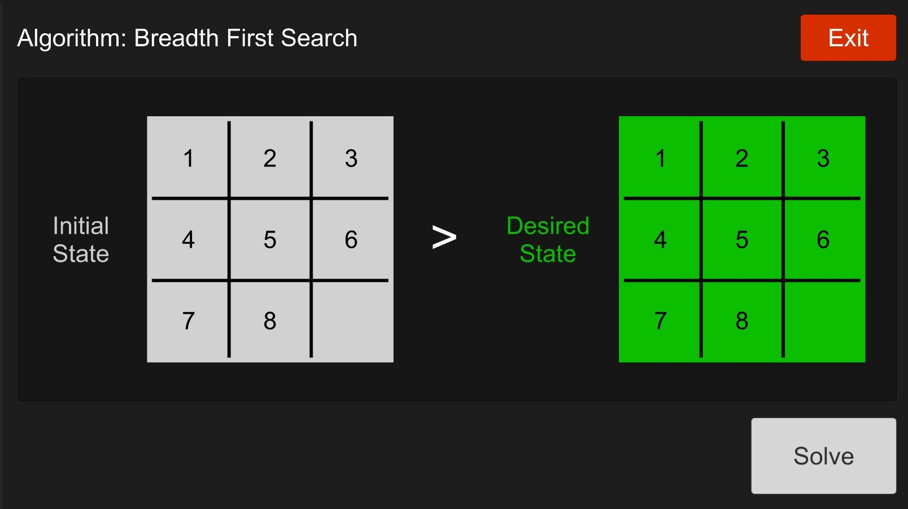
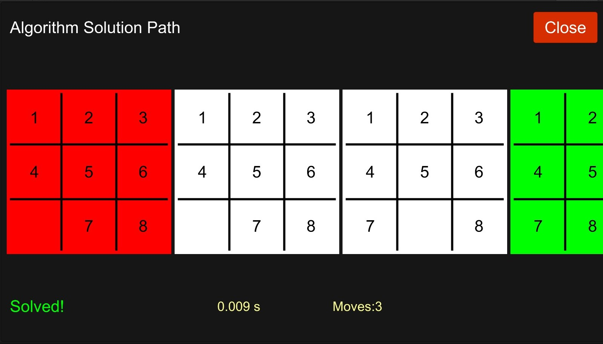

# Unity-Search-Algorithm-8Puzzle

You can modify Initial State & Desired State numbers by clicking the number then clicking on the empty square.
The algorithm begin searching for solutions from the Initial State until he reach the Desired State.

After hitting Solve wait for the algorithm to solve the puzzle once done it will display the time it took to find the solution & the number of moves and finally will visualize the paths the algorithm take to reach it’s Desired State.
